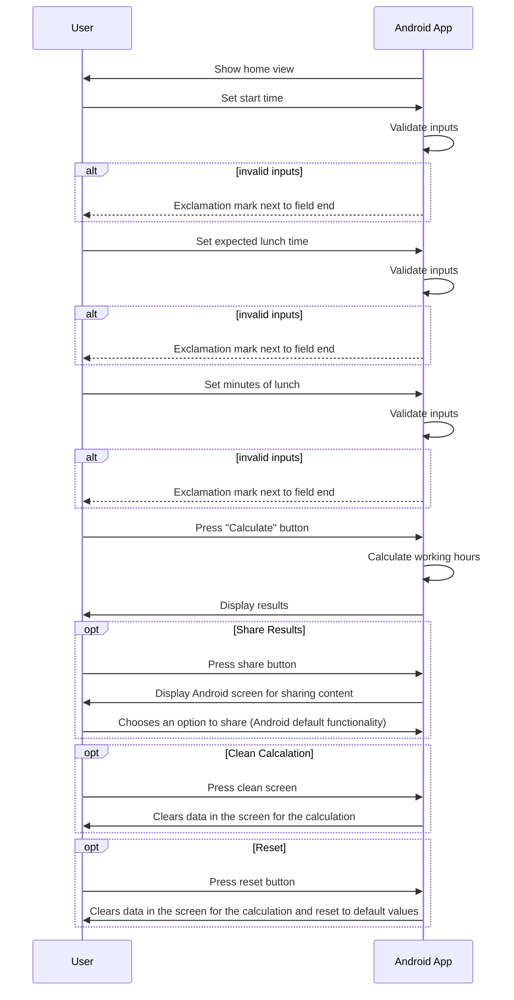
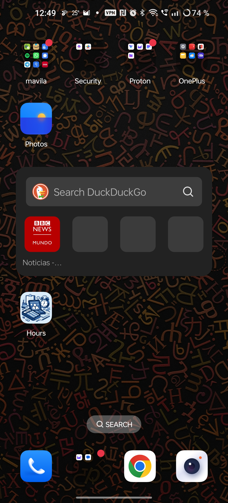

# Hours application in Android

An Android application based on the original project (on server side) to calculate working hours.

## Features

- Calculate working hours, inputs are:
  - Start time
  - Expected lunch time
  - Minutes of lunch
- Configure parameters for different countries (this is a work in progress, for the moment only
  Austria is supported)
  - Minutes per day of work (minutes of total work per day, e.g. in case of Austria 462 minutes, is
    equivalent to 7 hours and 42 minutes, or 7.7 hours)
  - Maximum time of work in a row (e.g. every 4 hours of work you need to have a break of 30
    minutes)
  - Minutes of breaks between of ranges (e.g. 30 minutes of break when 4 hours of work have been
    done)
  - Maximum hour of the day to finish work (e.g. some countries do not allow to work after 20:00
    hours)
    - When this value is empty it means that there is no limit to finish work
- Store above parameters in a local database
- Share working hours
- Clean and simple user interface
- Possibility to clean previous calculation
- Possibility to reset the input fields to the default values
- About screen with information about the application

## Development

As of now, the application is developed in Java and uses Gradle as a build system. The application
is developed using Android Studio.

Thanks to [Mermaid](https://mermaidjs.github.io/) to provide the plugin to produce the sequence
diagrams

## Configuration sequence diagram

## Calculate working hours sequence diagram

## Screenshots

These are the current screenshots of the application, these are subject to change in the future.

### Home screen

